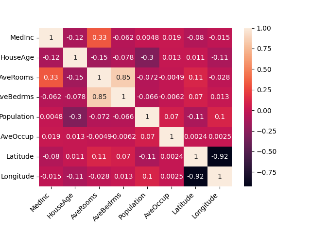

# California Housing Price Prediction

## Overview
This project is focused on predicting housing prices in California using the California Housing dataset. The script employs a Gradient Boosting Regressor and includes advanced functionalities such as correlation analysis, model performance evaluation through cross-validation, and hyperparameter optimization using GridSearchCV.

## Dataset
The dataset used is the California Housing dataset, a well-known dataset in the field of machine learning. It contains data related to housing in California, such as median income, housing median age, average rooms, average bedrooms, population, average occupancy, latitude, and longitude.

Below is a feature correlation matrix from the California Housing dataset:

## Features
- Gradient Boosting Regressor for prediction
- Cross-validation for model evaluation
- Hyperparameter optimization using GridSearchCV to enhance model performance. 

## How to Run
1. Clone this repository.
2. Install the required dependencies using `pip install -r requirements.txt`.
3. Run the script using `python gradient_boosting_housing.py`.

## Requirements

To run this project, you will need the following packages:

- scikit-learn
- pandas
- matplotlib
- seaborn